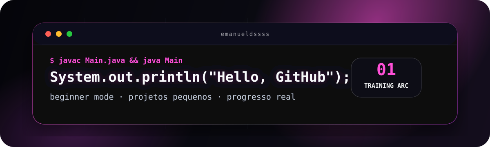

  

  

  
  

---

## `player.profile`

<table>
  <tr>
    <td width="56%" valign="top">
      <h3>Quem eu sou agora</h3>
      
Sou o Emanuel. Estou no começo da programação e prefiro mostrar evolução real em vez de fingir nível avançado.

      
Meu foco principal é <b>Java</b>. Uso <b>HTML &amp; CSS</b> para criar interfaces e <b>Python</b> para treinar lógica com scripts pequenos.

      
Gosto de computação, jogos, IA e da sensação de transformar uma ideia pequena em algo que roda de verdade.

    </td>
    <td width="44%" valign="top">
      <h3>Status do treino</h3>
      <pre><code>main_language = "Java"
level = "Beginner"
routine = "build -> break -> fix"
goal = "publicar projetos reais"</code></pre>
      
<b>Sem personagem fake:</b> commits reais, projetos pequenos e melhora constante.

    </td>
  </tr>
</table>

## Stack de treino

| Tecnologia | Nível | O que estou treinando |
|:---|:---:|:---|
| **Java** | Beginner | lógica, sintaxe, classes, métodos, terminal e primeiros mini-projetos |
| **HTML & CSS** | Beginner | estrutura, semântica, responsividade e páginas com visual limpo |
| **Python** | Beginner | exercícios, automações simples e raciocínio passo a passo |

## Missões públicas

| Missão | Entrega que eu quero colocar no ar | Por que importa |
|:---:|:---|:---|
| `01` | Aplicações Java no terminal | provar lógica funcionando sem maquiagem |
| `02` | Páginas HTML/CSS responsivas | treinar olho visual e organização |
| `03` | Scripts Python pequenos | automatizar tarefas e pensar melhor |
| `04` | READMEs decentes | explicar o que fiz, como rodar e o que aprendi |

## Registro de commits

<picture>
  <source media="(prefers-color-scheme: dark)" srcset="https://raw.githubusercontent.com/emanueldssss/emanueldssss/output/github-contribution-grid-snake-dark.svg" />
  <source media="(prefers-color-scheme: light)" srcset="https://raw.githubusercontent.com/emanueldssss/emanueldssss/output/github-contribution-grid-snake.svg" />
  
</picture>

---

  perfil em modo treino: rosa, terminal, jogos, IA e projetos reais.

