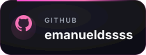
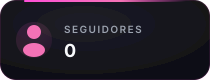
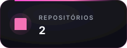
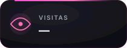

  

  

  
  
  
  

 

  

Sou apaixonado por computação e estou em desenvolvimento na área, com foco principal em Java. Gosto de aprender construindo, errando, corrigindo e deixando cada projeto um pouco melhor que o anterior.

  🔰 <b>Java</b> &nbsp;·&nbsp; 🎨 <b>HTML & CSS</b> &nbsp;·&nbsp; 🐍 <b>Python</b>
   
  🎮 Curto programação, jogos, IA e essa energia de treinar todo dia para evoluir
   
  💎 Perfil verdadeiro: nível beginner, evolução real, projetos com carinho

 

## Stack em foco

  
  
  
  
   
  Iniciando cada uma com projetos reais

| Tecnologia | Nível | Foco atual |
|:---|:---:|:---|
| **Java** | Beginner | Lógica, sintaxe, classes, métodos e primeiros projetos no terminal |
| **HTML & CSS** | Beginner | Estrutura de páginas, semântica, responsividade e visual limpo |
| **Python** | Beginner | Exercícios, scripts simples e treino de raciocínio |

## Ferramentas e IA que curto

  
  
  
  

## Mapa do perfil

| Área | Como vai aparecer aqui |
| --- | --- |
| Projetos | Aplicações pequenas em Java, HTML & CSS e Python, com README claro. |
| Estudos | Exercícios e anotações práticas para acompanhar minha evolução. |
| Evolução | Commits reais, sem fingir nível avançado antes da hora. |
| Estilo | Código, criatividade, jogos, IA e carinho nos detalhes. |

## Painel do GitHub

  

  Os cards de linguagens ficam melhores conforme os primeiros repositórios públicos forem nascendo.

## Laboratório público

  
  

Os primeiros repositórios públicos vão aparecer aqui conforme forem publicados. A ideia é manter cada entrega pequena, visual e fácil de abrir.

<picture>
  <source media="(prefers-color-scheme: dark)" srcset="https://raw.githubusercontent.com/emanueldssss/emanueldssss/output/github-contribution-grid-snake-dark.svg" />
  <source media="(prefers-color-scheme: light)" srcset="https://raw.githubusercontent.com/emanueldssss/emanueldssss/output/github-contribution-grid-snake.svg" />
  
</picture>
