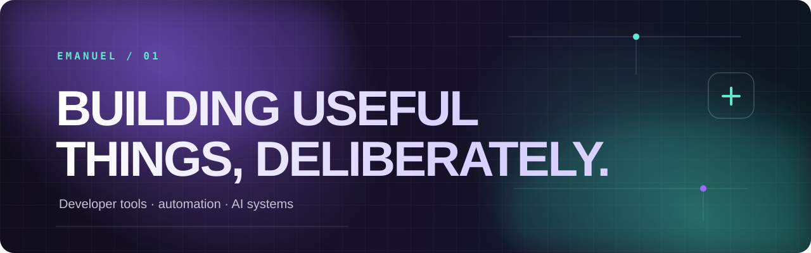

  

  
  

 

## Building tools that make developers faster

I build focused developer tools around AI, automation and privacy. The work here is practical: clear setup, thoughtful defaults and software people can actually run.

 

## Selected work

<table>
  <tr>
    <td width="50%" valign="top">
      <h3><a href="https://github.com/emanueldssss/fusion">01 — Fusion</a></h3>
      
A multi-agent debate engine: two models reason together and a third synthesizes the final answer. Built with secure key handling, rate limits and redacted logs.

      
<code>Python</code> <code>LLM orchestration</code> <code>CLI</code>

    </td>
    <td width="50%" valign="top">
      <h3><a href="https://github.com/emanueldssss/SeeIT-skill">02 — SeeIT</a></h3>
      
A skill and MCP server that gives non-visual agents a way to inspect, describe and extract information from images through vision models.

      
<code>Python</code> <code>MCP</code> <code>Vision AI</code>

    </td>
  </tr>
  <tr>
    <td width="50%" valign="top">
      <h3>03 — Torify</h3>
      
Cross-platform tooling to route applications through Tor with a friendly CLI, automated setup and straightforward network checks.

      
<a href="https://github.com/emanueldssss/Torify-Linux">Linux</a> &nbsp;·&nbsp; <a href="https://github.com/emanueldssss/Torify-Windows">Windows</a>

      
<code>Python</code> <code>PowerShell</code> <code>Networking</code>

    </td>
    <td width="50%" valign="top">
      <h3>04 — What I’m exploring</h3>
      
Agent skills, tool calling, reliable local automation and the engineering choices that turn a prototype into a useful daily tool.

      
<code>Java</code> <code>Data structures</code> <code>HTML / CSS</code>

    </td>
  </tr>
</table>

 

## Toolbox

  

 

  <a href="mailto:emanueldssss@proton.me">emanueldssss@proton.me</a>
  &nbsp;·&nbsp;
  <a href="https://github.com/emanueldssss">github.com/emanueldssss</a>

